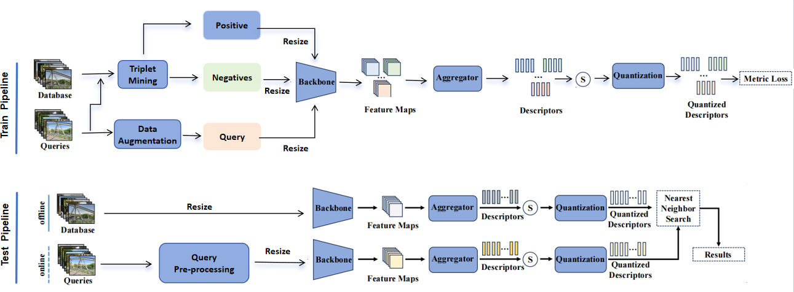

<div align="center">
<h1>面向无人机场景的图像地理定位系统设计与实现</h1>
</div>

<p align="center">
 <br>
</p>

## Table of Contents
This repository supplies only the software‑module code; the hardware components are not available for remote testing.
  - [Quick Start](#quick-start)
  - [Datasets](#datasets)
## Quick Start
Quick start is based on Dino as an example, other models can change the base model path.
### 1. Installation
```
pip install -r requirement.txt
```

### 2. Train and test overall system

```
bash run.sh
```

## datasets
Our entire dataset includes multimodal drone images and satellite images. The dataset will be released later


## Citation
Comming !!!
